# Project Schema — Ecommerce Microservices Platform

## Index

1. [General Architecture Diagram](#1-general-architecture-diagram)
2. [Auth Service](#2-auth-service)
3. [User Service](#3-user-service)
4. [Product Service](#4-product-service)
5. [Order Service](#5-order-service)
6. [Gateway](#6-gateway)
7. [Config Server & Discovery Server](#7-config-server--discovery-server)
8. [Frontend](#8-frontend)
9. [Entity Relationship Diagram (ERD)](#9-entity-relationship-diagram-erd)
10. [Kafka Event Flow](#10-kafka-event-flow)
11. [OAuth2 Authentication Flow](#11-oauth2-authentication-flow)

---

## 1. General Architecture Diagram

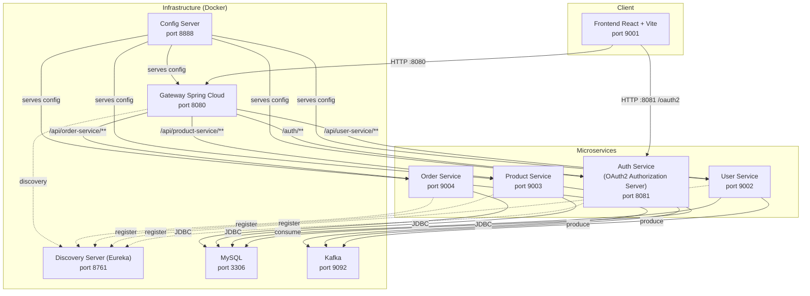

---

## 2. Auth Service

### Service Layers

```mermaid
graph TB
    subgraph "Controllers"
        RC["RegisterController\n/auth/api"]
        UWC["UserWebController\n/user"]
        LC["LoginController\n/login, /"]
        OIC["OAuth2InfoController\n/oauth2"]
        OCC["OAuth2ConsentController\n/oauth2/consent"]
        AEC["AuthErrorController\n/error"]
    end

    subgraph "Service Layer"
        MDS["MyUserDetailsService\nimplements UserDetailsService"]
    end

    subgraph "Repository Layer"
        AUR["AppUserRepository\nJpaRepository"]
        RR["RoleRepository\nCrudRepository"]
    end

    subgraph "Entities"
        AU["AppUser\n@Entity @Table=app_user"]
        R["Role\n@Entity @Table=role"]
    end

    subgraph "Config"
        SC["SecurityConfig\nSecurityFilterChain, PasswordEncoder,\nJWKSource, OAuth2TokenCustomizer"]
        CC["ClientConfig\nRegisteredClientRepository"]
        DI["DataInitializer\nSeeder: roles + admin"]
        AC["AuthConstants\nOAuth2 constants"]
    end

    RC --> AUR
    RC --> RR
    MDS --> AUR
    UWC --> AUR
    UWC --> RR

    AU -->|"@ManyToMany"| R
    R -->|"implements GrantedAuthority"| AU

    DI --> AUR
    DI --> RR
    SC --> AC
    CC --> AC
```

### Endpoints

| Method | Path | Access | Description |
|--------|------|--------|-------------|
| `POST` | `/auth/api/register` | Public | User registration via REST |
| `GET` | `/user/register` | Public | Registration form |
| `POST` | `/user/register` | Public | User registration via form |
| `GET` | `/login` | Public | Login page |
| `GET` | `/` | Public | Home |
| `GET` | `/oauth2/consent` | Public | OAuth2 consent screen |
| `GET` | `/oauth2/server-info` | Public | OAuth2 server info |
| `GET` | `/oauth2/test-direct` | Public | Test endpoint |
| `GET` | `/error` | Public | Error handling |

### Entities

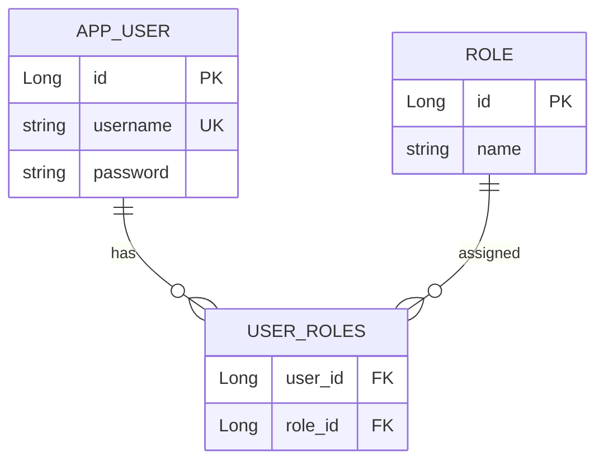

---

## 3. User Service

### Service Layers

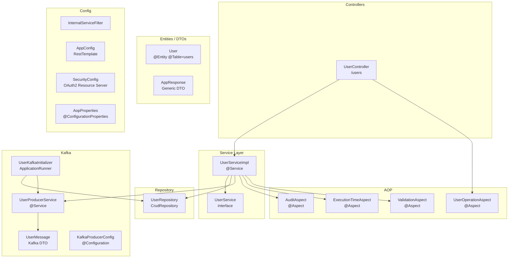

### Endpoints

| Method | Path | Access | Description |
|--------|------|--------|-------------|
| `GET` | `/users/hello` | Public | Basic health check |
| `GET` | `/users/me` | USER | Get user by email |
| `POST` | `/users/me/create` | USER | Create user profile |
| `PUT` | `/users/me/update` | USER | Update profile |
| `DELETE` | `/users/me/delete` | USER | Delete profile |
| `GET` | `/users/me/current` | USER/ADMIN | Get current user |
| `GET` | `/users/find` | Internal | Find user by email |

### Entity

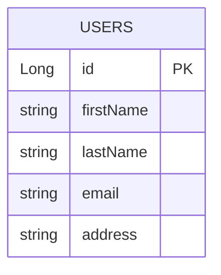

### Kafka Events

| Event | Topic | Description |
|--------|--------|-------------|
| `UserCreated` | `user` | User created |
| `UserUpdated` | `user` | User updated |
| `UserDeleted` | `user` | User deleted |

---

## 4. Product Service

### Service Layers

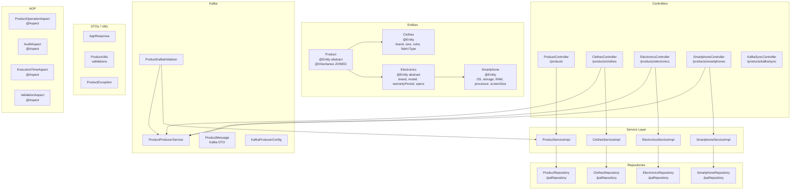

### Endpoints

| Method | Path | Access | Description |
|--------|------|--------|-------------|
| `GET` | `/products` | Public | List all products |
| `GET` | `/products/categories` | Public | List categories |
| `POST` | `/products/clothes` | ADMIN | Create clothes |
| `GET` | `/products/clothes` | Public | List clothes |
| `GET` | `/products/clothes/{id}` | Public | Get clothes by ID |
| `PUT` | `/products/clothes/{id}` | ADMIN | Update clothes |
| `DELETE` | `/products/clothes/{id}` | ADMIN | Delete clothes |
| `POST` | `/products/electronics` | ADMIN | Create electronics |
| `GET` | `/products/electronics` | Public | List electronics |
| `GET` | `/products/electronics/{id}` | Public | Get electronics by ID |
| `PUT` | `/products/electronics/{id}` | ADMIN | Update electronics |
| `DELETE` | `/products/electronics/{id}` | ADMIN | Delete electronics |
| `POST` | `/products/smartphones` | ADMIN | Create smartphone |
| `GET` | `/products/smartphones` | Public | List smartphones |
| `GET` | `/products/smartphones/{id}` | Public | Get smartphone by ID |
| `PUT` | `/products/smartphones/{id}` | ADMIN | Update smartphone |
| `DELETE` | `/products/smartphones/{id}` | ADMIN | Delete smartphone |
| `POST` | `/products/kafka/sync/force-full-sync` | ADMIN | Force Kafka sync |
| `GET` | `/products/kafka/sync/status` | ADMIN | Sync status |

### Inheritance Hierarchy

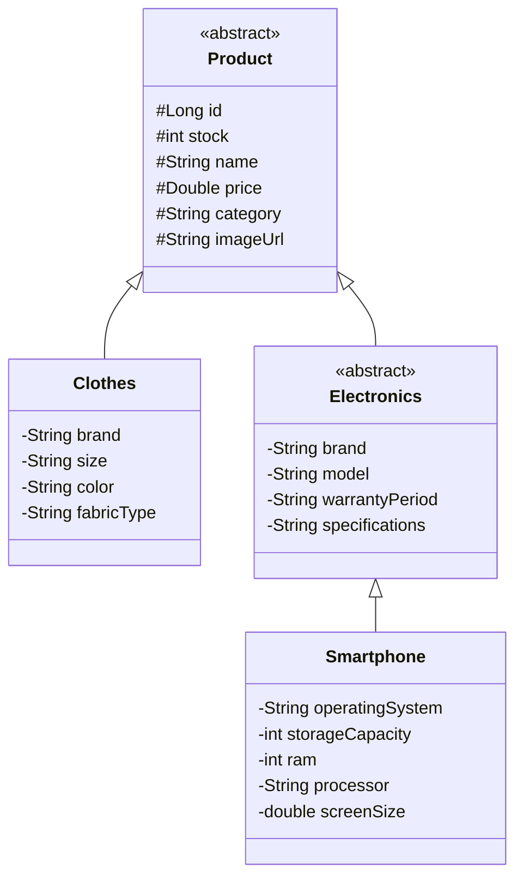

### Kafka Events

| Event | Topic | Description |
|--------|--------|-------------|
| `ProductCreated` | `product` | Product created |
| `ProductUpdated` | `product` | Product updated |
| `ProductDeleted` | `product` | Product deleted |

---

## 5. Order Service

### Service Layers

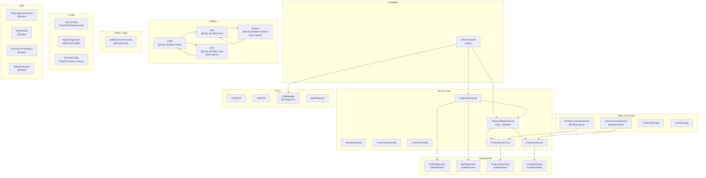

### Endpoints

| Method | Path | Access | Description |
|--------|------|--------|-------------|
| `GET` | `/orders/` | ADMIN | List all orders |
| `GET` | `/orders/find?id=` | ADMIN | Find order by ID |
| `GET` | `/orders/me` | USER | Authenticated user's orders |
| `POST` | `/orders/me` | USER | Create order |
| `PUT` | `/orders/me` | USER | Update order |
| `DELETE` | `/orders/me?id=` | USER | Delete order |

### Entities

```mermaid
erDiagram
    ORDERS {
        Long id PK
        Long user_id FK
        datetime createdAt
    }

    ITEMS {
        Long id PK
        Long order_id FK
        Long product_id FK
        int quantity
    }

    USERS {
        Long id PK
        string firstName
        string lastName
        string email
        string address
    }

    PRODUCTS {
        Long id PK
        string name
        double price
        int stock
        string category
        string imageUrl
        string brand
    }

    ORDERS ||--o{ ITEMS : contains
    ORDERS }o--|| USERS : belongs to
    ITEMS }o--|| PRODUCTS : references
```

---

## 6. Gateway

### Internal Architecture

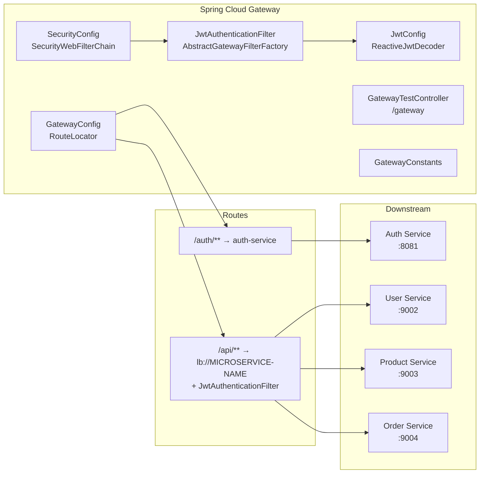

### Health Endpoints

| Method | Path | Access | Description |
|--------|------|--------|-------------|
| `GET` | `/gateway/test` | USER/ADMIN | Auth test |
| `GET` | `/gateway/health` | ADMIN | Full health check |
| `GET` | `/gateway/health/public` | Public | Basic health check |
| `GET` | `/gateway/health/user` | USER/ADMIN | Health with user info |

### Route Map

| Public Route | Destination | Auth | Roles |
|---|---|---|---|
| `GET /product-service/products/**` | Product Service | Public | — |
| `GET /product-service/products` | Product Service | Public | — |
| `GET /user-service/users/hello` | User Service | Public | — |
| `/auth/**` | Auth Service | Public | — |
| `/actuator/**` | — | Public | — |
| `/gateway/health/public` | Gateway | Public | — |

| Protected Route | Destination | Roles |
|---|---|---|
| `POST/PUT/DELETE /product-service/**` | Product Service | ADMIN |
| `/user-service/users/me/**` | User Service | USER |
| `/order-service/orders/me/**` | Order Service | USER |
| `/order-service/orders` | Order Service | ADMIN |
| `/order-service/orders/find` | Order Service | ADMIN |
| `/gateway/health` | Gateway | ADMIN |
| `/gateway/health/user` | Gateway | USER/ADMIN |

---

## 7. Config Server & Discovery Server

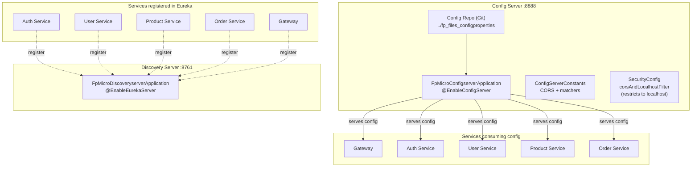

---

## 8. Frontend

### Component Architecture

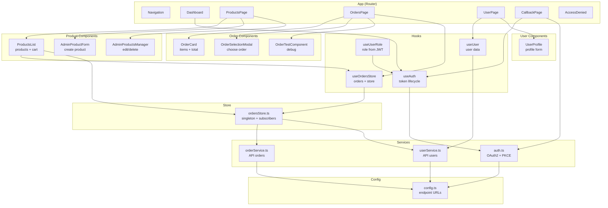

### Routing

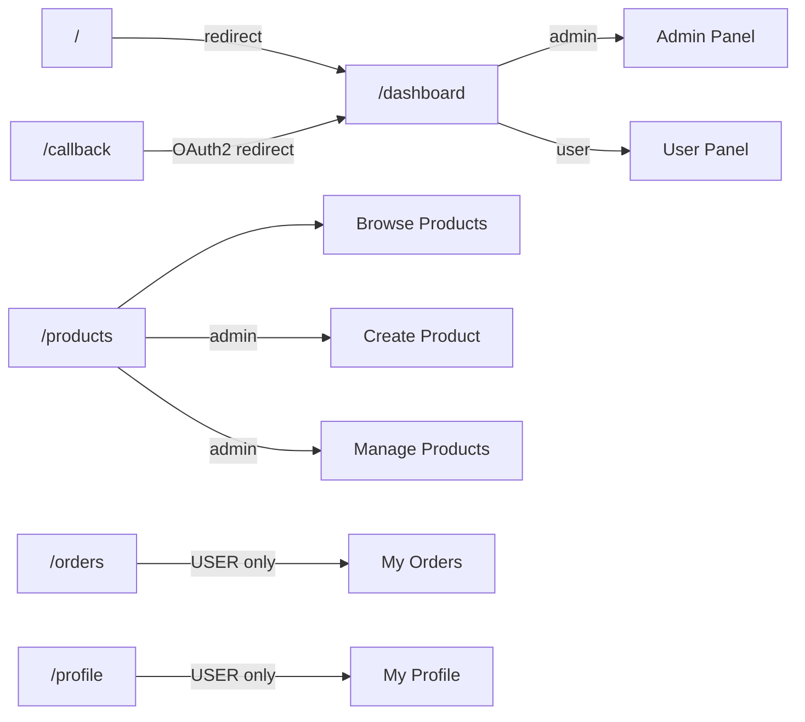

### External Services (API Calls)

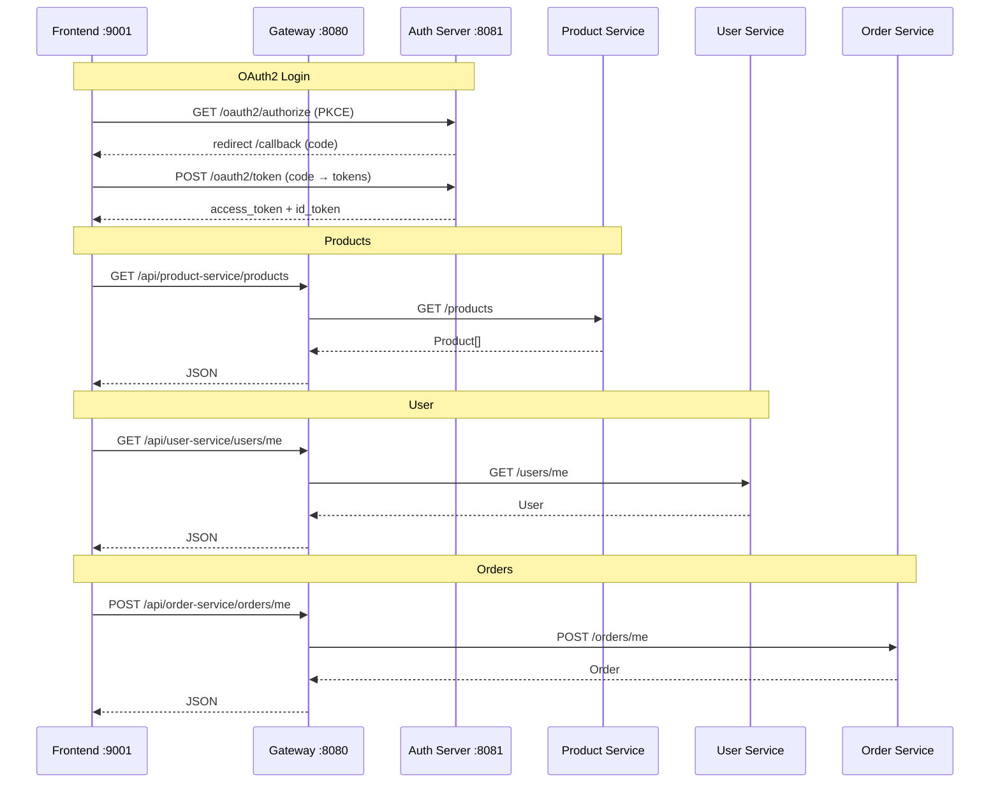

---

## 9. Entity Relationship Diagram (ERD)

### Cross-Service Overview

```mermaid
erDiagram
    APP_USER {
        Long id PK
        string username UK
        string password
    }

    ROLE {
        Long id PK
        string name
    }

    USER_ROLES {
        Long user_id FK
        Long role_id FK
    }

    USERS {
        Long id PK
        string firstName
        string lastName
        string email UK
        string address
    }

    PRODUCT {
        Long id PK
        int stock
        string name
        double price
        string category
        string imageUrl
    }

    CLOTHES {
        Long id PK FK
        string brand
        string size
        string color
        string fabricType
    }

    ELECTRONICS {
        Long id PK FK
        string brand
        string model
        string warrantyPeriod
        string specifications
    }

    SMARTPHONE {
        Long id PK FK
        string operatingSystem
        int storageCapacity
        int ram
        string processor
        double screenSize
    }

    ORDERS {
        Long id PK
        Long user_id FK
        datetime createdAt
    }

    ITEMS {
        Long id PK
        Long order_id FK
        Long product_id FK
        int quantity
    }

    APP_USER ||--o{ USER_ROLES : has
    ROLE ||--o{ USER_ROLES : assigned

    ORDERS ||--o{ ITEMS : contains
    ORDERS }o--|| USERS : belongs_to
    ITEMS }o--|| PRODUCTS : references

    PRODUCT ||--|| CLOTHES : is_a
    PRODUCT ||--|| ELECTRONICS : is_a
    ELECTRONICS ||--|| SMARTPHONE : is_a
```

### Table Notes

| Table | Database | Service | Purpose |
|-------|----------|---------|---------|
| `app_user` | MySQL (auth db) | Auth Service | Authentication system users |
| `role` | MySQL (auth db) | Auth Service | Roles (ROLE_USER, ROLE_ADMIN) |
| `user_roles` | MySQL (auth db) | Auth Service | User-role join table |
| `users` | MySQL (user db) | User Service | User profiles |
| `product` | MySQL (product db) | Product Service | Parent product table (JOINED) |
| `clothes` | MySQL (product db) | Product Service | Product subclass: clothes |
| `electronics` | MySQL (product db) | Product Service | Product subclass: electronics |
| `smartphone` | MySQL (product db) | Product Service | Electronics subclass: smartphones |
| `orders` | MySQL (order db) | Order Service | Purchase orders |
| `items` | MySQL (order db) | Order Service | Order line items |
| `users` (replica) | MySQL (order db) | Order Service | Local user replica via Kafka |
| `products` (replica) | MySQL (order db) | Order Service | Local product replica via Kafka |

---

## 10. Kafka Event Flow

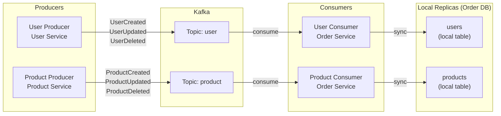

### Initialization

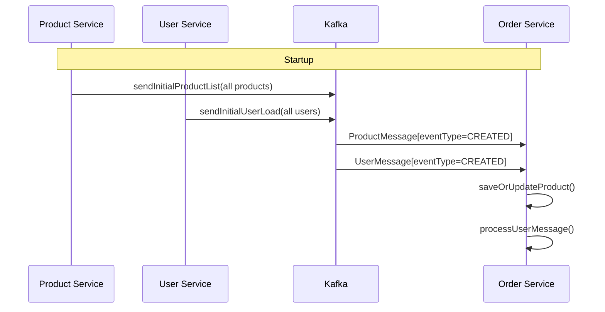

---

## 11. OAuth2 Authentication Flow

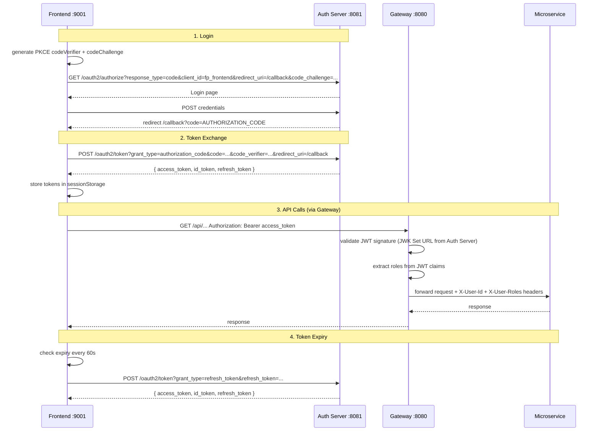

---

## Port and Service Summary

| Service | Internal Port | Host Port | Docker Name |
|---------|--------------|-----------|-------------|
| Config Server | 8888 | 8888 | config-server |
| Discovery Server | 8761 | 8761 | discovery-server |
| Gateway | 8080 | 8080 | gateway |
| Auth Service | 8081 | 8081 | auth-service |
| User Service | 8080 | 9002 | user-service |
| Product Service | 8080 | 9003 | product-service |
| Order Service | 8080 | 9004 | order-service |
| Frontend | 9001 | 9001 | frontend |
| MySQL | 3306 | 3306 | mysql |
| Kafka | 9092 | 9092 | kafka |
